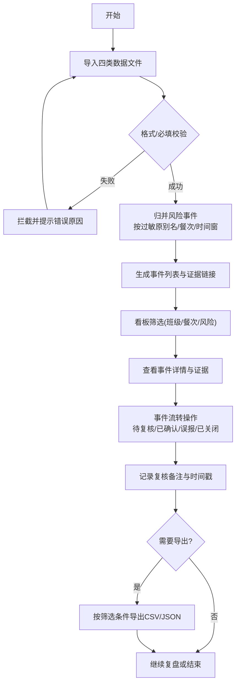

## 1. 产品概述
校餐过敏投诉复盘看板是一款面向学校后勤和食品安全管理团队的本地化数据复盘工具。通过导入菜单、学生过敏档案、领餐记录和投诉数据，自动归并过敏原风险事件，支持证据溯源、事件流转复核与结果导出，帮助团队系统化完成过敏事件的追溯、研判与闭环管理。

- **核心问题**：过敏投诉零散、证据链断裂、复盘无标准化流程，难以快速定位风险源头
- **目标用户**：学校后勤管理员、食品安全员、校医室工作人员
- **产品价值**：一键归并风险、可视化证据链、标准化复核流程、数据持久化可追溯

## 2. 核心功能

### 2.1 用户角色
| 角色 | 登录方式 | 核心权限 |
|------|----------|----------|
| 管理员 | 本地无需登录 | 导入数据、查看看板、复核事件、导出结果、管理配置 |

### 2.2 功能模块
1. **数据导入模块**：菜单/过敏档案/领餐记录/投诉JSON的拖拽或选择导入，含格式校验与错误拦截
2. **风险事件看板**：事件卡片列表、统计概览、多维筛选器
3. **事件详情与证据**：来源证据链接展示、过敏原归并信息、时间窗与餐次信息
4. **事件流转工作台**：待复核→已确认/误报/已关闭，复核备注记录
5. **数据导出模块**：按筛选条件导出CSV/JSON明细，隐藏事件不混入
6. **系统状态**：重启后状态持久化、导出数据一致性校验

### 2.3 页面详情
| 页面名称 | 模块名称 | 功能描述 |
|-----------|-------------|---------------------|
| 主看板 | 顶部统计栏 | 展示事件总数、各状态数量、高风险数量统计卡 |
| 主看板 | 筛选器栏 | 班级多选、餐次单选/多选、风险等级筛选 |
| 主看板 | 导入区 | 四类数据文件导入入口，导入日志展示 |
| 主看板 | 事件列表 | 卡片式事件列表，含状态标签、风险等级、过敏原标签 |
| 事件详情抽屉 | 基本信息 | 事件ID、归并维度、涉及学生、班级、餐次、时间 |
| 事件详情抽屉 | 证据链 | 菜单行、过敏档案、领餐记录、投诉记录的来源证据展开 |
| 事件详情抽屉 | 复核区 | 状态切换下拉、备注输入、保存按钮、流转日志时间线 |
| 配置弹窗 | 过敏原别名 | 别名配置增删改，错误配置拦截 |
| 导出面板 | 导出选项 | 格式选择(CSV/JSON)、筛选条件确认、导出预览、下载按钮 |

## 3. 核心流程
用户通过样例文件导入系统，系统校验数据完整性后自动归并生成风险事件；用户在看板中筛选事件，进入详情查看证据链，进行复核操作并填写备注；最后按当前筛选条件导出明细数据。

## 4. 用户界面设计

### 4.1 设计风格
- **主色调**：深石板灰(slate-800)为底，海蓝(teal-500)为强调，琥珀(amber-500)警示高风险，翡翠(emerald-500)标识已关闭
- **辅助色**：玫瑰红(rose-500)误报，天蓝(sky-500)待复核
- **按钮风格**：微圆角(6px)、浅边框、悬停轻度上浮阴影
- **字体**：思源黑体(Noto Sans SC)为正文字体，等宽字体(JetBrains Mono)用于ID和数据展示
- **布局**：顶部导航+左侧筛选+中间事件卡片区+右侧详情抽屉，信息密度高
- **图标风格**：Lucide线性图标，配合状态色块使用

### 4.2 页面设计概述
| 页面名称 | 模块名称 | UI元素 |
|-----------|-------------|-------------|
| 主看板 | 统计栏 | 四色数据卡片，数值+趋势标签，悬停高亮边框 |
| 主看板 | 筛选栏 | 胶囊式多选tag、下拉选择器、滑块组件 |
| 主看板 | 事件卡片 | 状态徽章(左上)、风险等级条(左侧竖条)、过敏原标签组、学生信息摘要、餐次时间、操作按钮 |
| 事件详情 | 证据区块 | 可折叠手风琴，每项含文件来源标识、原始数据预览、复制按钮 |
| 事件详情 | 流转日志 | 时间轴线+节点卡片，操作人/时间/状态/备注 |
| 导入弹窗 | 拖拽区 | 虚线边框拖放区域，文件列表带校验状态图标，错误行高亮 |

### 4.3 响应式
- 桌面优先(1280px+)：三栏布局，详情抽屉固定右侧35%宽度
- 平板(768-1279px)：筛选栏折叠为顶部下拉，详情抽屉改为全屏弹窗
- 移动端(<768px)：单列卡片列表，筛选器折叠为顶部面板

### 4.4 动效与微交互
- 页面加载：卡片渐入+轻微上移(stagger 50ms)
- 状态变更：状态徽章脉冲动画+轻量toast提示
- 证据展开：手风琴平滑展开，代码块淡入
- 导入进度：进度条渐变填充+文件项逐个标记完成
