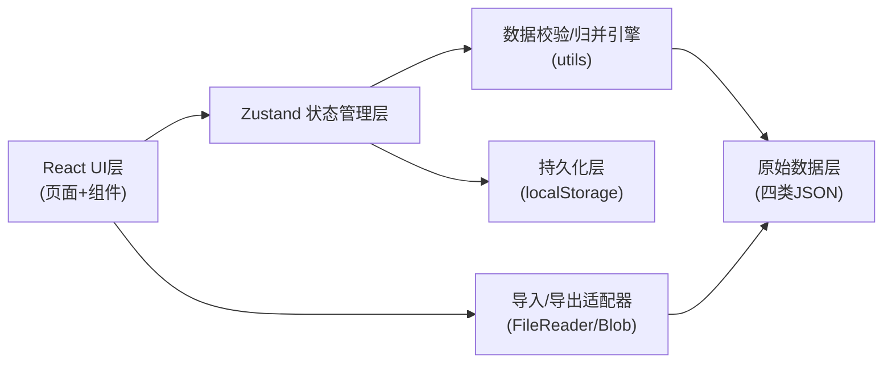
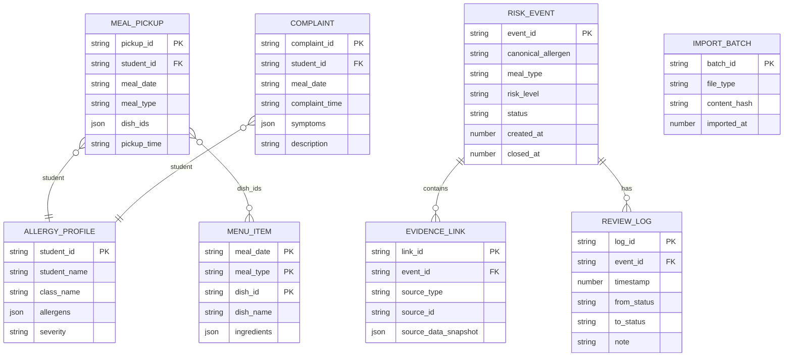

## 1. 架构设计
纯前端本地化应用，使用浏览器 localStorage 做数据持久化，无需后端服务。



## 2. 技术描述
- **前端框架**：React@18 + TypeScript + Vite@5
- **样式方案**：Tailwind CSS@3
- **状态管理**：Zustand@4（含 persist 中间件做 localStorage 持久化）
- **图标库**：Lucide React
- **路由**：React Router DOM（单页无需路由，用状态切换弹窗/抽屉）
- **数据持久化**：localStorage（zustand/persist 中间件）
- **初始化工具**：vite-init（react-ts 模板）

## 3. 路由定义
单页应用，无多页面路由，使用组件状态控制弹窗/抽屉显示：
| 状态路径 | 用途 |
|---------|------|
| / (主看板) | 默认页面，含统计栏、筛选、事件列表、导入区 |
| #detail=:eventId | URL哈希标记当前打开的事件详情抽屉 |

## 4. 核心数据结构

### 4.1 原始数据模型

```typescript
// 菜单行
interface MenuItem {
  meal_date: string;       // 必填 YYYY-MM-DD
  meal_type: 'breakfast' | 'lunch' | 'dinner' | 'snack';
  dish_id: string;         // 必填
  dish_name: string;
  ingredients: string[];   // 原料清单（含过敏原线索）
  allergens_tagged?: string[];
}

// 学生过敏档案
interface AllergyProfile {
  student_id: string;
  student_name: string;
  class_name: string;
  allergens: string[];     // 过敏原标准名
  severity: 'mild' | 'moderate' | 'severe';
}

// 领餐记录
interface MealPickup {
  pickup_id: string;
  student_id: string;
  meal_date: string;
  meal_type: string;
  dish_ids: string[];      // 关联菜单 dish_id
  pickup_time: string;     // ISO
}

// 投诉记录
interface Complaint {
  complaint_id: string;
  student_id: string;
  meal_date: string;
  meal_type?: string;
  complaint_time: string;  // ISO
  symptoms: string[];
  description: string;
  suspected_allergens?: string[];
}

// 过敏原别名配置
interface AllergenAliasMap {
  [canonical: string]: string[];  // 标准名 → 别名列表
}
```

### 4.2 风险事件模型

```typescript
type EventStatus = 'pending' | 'confirmed' | 'false_alarm' | 'closed';
type RiskLevel = 'high' | 'medium' | 'low';

interface EvidenceLink {
  type: 'menu' | 'profile' | 'pickup' | 'complaint';
  source_id: string;
  source_data: any;       // 完整原始数据快照
  imported_at: number;
}

interface ReviewLog {
  id: string;
  timestamp: number;
  from_status: EventStatus | null;
  to_status: EventStatus;
  note: string;
}

interface RiskEvent {
  event_id: string;       // 自动生成: EVT-{hash}
  canonical_allergen: string;        // 归并过敏原标准名
  matched_aliases: string[];         // 命中的别名
  meal_type: string;
  time_window_start: string;         // ISO
  time_window_end: string;           // ISO
  student_ids: string[];
  student_names: string[];
  class_names: string[];
  risk_level: RiskLevel;
  status: EventStatus;
  evidence: EvidenceLink[];
  review_logs: ReviewLog[];
  latest_note?: string;
  closed_at?: number;
  created_at: number;
  updated_at: number;
  hidden?: boolean;       // 被筛选排除标记（不持久化，运行时）
}
```

### 4.3 导入批次模型（防重复导入）

```typescript
interface ImportBatch {
  batch_id: string;        // 基于文件内容hash
  file_type: 'menu' | 'profile' | 'pickup' | 'complaint';
  file_name: string;
  content_hash: string;    // SHA1
  record_count: number;
  imported_at: number;
}
```

## 5. 数据模型ER图



## 6. 校验与归并规则

### 6.1 导入校验（失败路径拦截）
1. **菜单行**：`meal_date` 必须存在且格式为 `YYYY-MM-DD`，`dish_id` 不能为空字符串；否则整行跳过并记录错误
2. **投诉JSON**：必须合法JSON，顶层必须是数组或含 `complaints` 字段的对象；每条必须有 `complaint_id`/`student_id`/`meal_date`/`complaint_time`
3. **过敏原别名**：标准名不能为空，别名列表不能有重复项；不能出现循环别名（A→B，B→A）
4. **重复导入**：对文件内容计算 SHA1，若存在于 `IMPORT_BATCH` 中则整体拒绝

### 6.2 事件归并规则
- **归并维度**：`canonical_allergen + meal_type + 时间窗(±2小时窗口)`
- **过敏原标准化**：遍历原料/症状/怀疑过敏原 → 通过别名表映射标准名
- **风险等级**：
  - HIGH: 档案严重过敏 + 领餐匹配 + 有投诉记录
  - MEDIUM: 档案过敏 + 领餐匹配 或 档案 + 投诉
  - LOW: 仅原料标签匹配 + 无领餐记录

### 6.3 复核保护规则
- 导入新数据时：若事件已存在（按 event_id），只追加证据，**绝不覆盖** `status`/`review_logs`/`closed_at`/`latest_note`
- 导出时：仅导出当前筛选结果中 `hidden=false` 的事件
